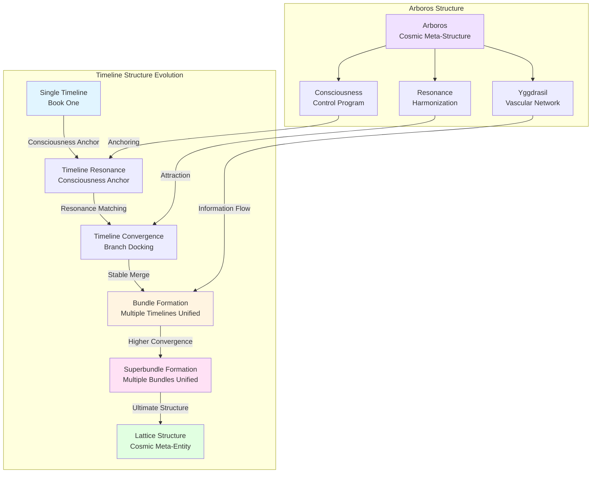
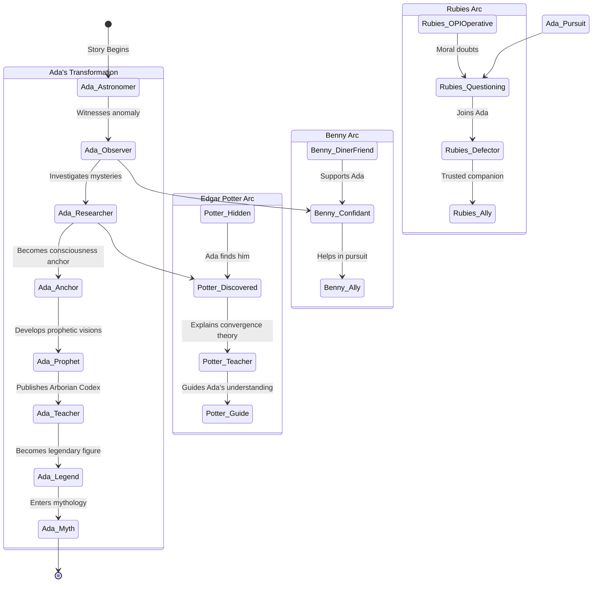
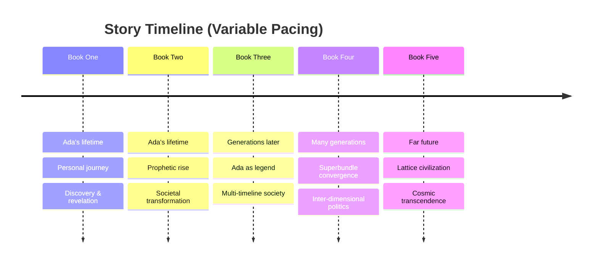

# Prose Ada - Story Arc State Machine Diagram

This diagram visualizes the high-level story architecture, showing the progression through books, key states, timeline convergence mechanics, and the evolution of the Arboros structure.

## State Machine Diagram

```mermaid
stateDiagram-v2
    [*] --> BookOne_InitialState: Story Begins
    
    state "Book One: Initial Encounter & Revelation" as BookOne {
        BookOne_InitialState --> BookOne_Anomaly: Sunset sky anomaly
        BookOne_Anomaly --> BookOne_ConsciousnessAnchor: Ada becomes conscious anchor
        BookOne_ConsciousnessAnchor --> BookOne_Dream: Yggdrasil dream vision
        BookOne_Dream --> BookOne_Research: Research into myths & anomalies
        BookOne_Research --> BookOne_PotterDiscovery: Discovers Edgar Potter's work
        BookOne_PotterDiscovery --> BookOne_Pursuit: OPI pursuit begins
        BookOne_Pursuit --> BookOne_MeetPotter: Finds Edgar Potter
        BookOne_MeetPotter --> BookOne_Revelation: Understands timeline convergence
        BookOne_Revelation --> BookOne_YggdrasilVision: Perceives Arboros/Yggdrasil
    }
    
    BookOne_YggdrasilVision --> BookTwo_PropheticAwakening: Transition to Book Two
    
    state "Book Two: ADA ROSE" as BookTwo {
        BookTwo_PropheticAwakening --> BookTwo_VisionsIntensify: Dreams & visions clarify
        BookTwo_VisionsIntensify --> BookTwo_Teachings: Ada develops philosophy
        BookTwo_Teachings --> BookTwo_PublicRevelation: Publishes Arborian Codex
        BookTwo_PublicRevelation --> BookTwo_SocietalTransformation: Society begins transformation
        BookTwo_SocietalTransformation --> BookTwo_Conflict: Controversy & resistance
        BookTwo_Conflict --> BookTwo_Acceptance: Gradual acceptance
        BookTwo_Acceptance --> BookTwo_FirstConvergence: Ada facilitates first intentional convergence
    }
    
    BookTwo_FirstConvergence --> BookThree_BundleFormation: Timelines merge into Bundle
    
    state "Book Three: The Arborian Age" as BookThree {
        BookThree_BundleFormation --> BookThree_AdaLegend: Ada becomes legendary prophet
        BookThree_AdaLegend --> BookThree_MultiTimelineSociety: Multi-history civilization emerges
        BookThree_MultiTimelineSociety --> BookThree_KnowledgeExchange: Biological & tech knowledge sharing
        BookThree_KnowledgeExchange --> BookThree_CulturalBlending: Cultural integration
        BookThree_CulturalBlending --> BookThree_Challenges: Societal challenges & crises
        BookThree_Challenges --> BookThree_Stability: Stable bundle society achieved
    }
    
    BookThree_Stability --> BookFour_SuperbundleAwareness: Recognition of larger pattern
    
    state "Book Four: Superbundle" as BookFour {
        BookFour_SuperbundleAwareness --> BookFour_NewProphets: New prophets interpret Ada's legacy
        BookFour_NewProphets --> BookFour_Preparation: Preparation for superbundle convergence
        BookFour_Preparation --> BookFour_Diplomacy: Inter-dimensional diplomacy
        BookFour_Diplomacy --> BookFour_PhilosophicalDebate: Philosophical & existential debates
        BookFour_PhilosophicalDebate --> BookFour_SuperbundleMerge: Two superbundles merge
    }
    
    BookFour_SuperbundleMerge --> BookFive_LatticeFormation: Lattice structure emerges
    
    state "Book Five: The Lattice and the Cycle" as BookFive {
        BookFive_LatticeFormation --> BookFive_AncientScripture: Ada's teachings become ancient
        BookFive_AncientScripture --> BookFive_StableLattice: Stable lattice civilization
        BookFive_StableLattice --> BookFive_SplittingQuestion: Question of potential splitting
        BookFive_SplittingQuestion --> BookFive_PhilosophicalReckoning: Grapple with identity loss
        BookFive_PhilosophicalReckoning --> BookFive_Transcendence: Understanding of cosmic purpose
        BookFive_Transcendence --> BookFive_ArborosRevelation: Arboros as self-creating entity
    }
    
    BookFive_ArborosRevelation --> [*]: Story Complete
    
    note right of BookOne_ConsciousnessAnchor
        Consciousness acts as anchor/lightning rod
        for timeline convergence (Velcro effect)
    end note
    
    note right of BookTwo_FirstConvergence
        First stable intentional timeline convergence
        Establishes infrastructure for multi-timeline society
    end note
    
    note right of BookThree_MultiTimelineSociety
        Bundle: Multiple timelines unified
        into single coherent civilization
    end note
    
    note right of BookFour_SuperbundleMerge
        Superbundle: Multiple bundles merge
        into larger unified structure
    end note
    
    note right of BookFive_ArborosRevelation
        Ultimate realization: Universe is self-organizing
        cosmic being creating itself through timeline
        convergence (Arboros)
    end note
```

## Timeline Convergence Mechanics

## Character Arc Progression

## Key Concepts & States

### Core Mechanics
- **Consciousness Anchor**: Individual consciousness acts as "lightning rod" for timeline convergence
- **Resonance Matching**: Timelines attract based on similarity/compatibility
- **Velcro Effect**: Consciousness entanglement stabilizes timeline interactions
- **Branch Docking**: Physical manifestation of timeline convergence (Yggdrasil branches)

### Structural Evolution
1. **Single Timeline** → Individual reality
2. **Timeline Resonance** → Consciousness-mediated attraction
3. **Timeline Convergence** → Two timelines merge
4. **Bundle** → Multiple timelines unified (~8-20 timelines)
5. **Superbundle** → Multiple bundles unified
6. **Lattice** → Cosmic meta-structure of all converged realities

### Arboros Components
- **Yggdrasil**: Vascular network (branches/roots) connecting timelines
- **Consciousness**: Control program maintaining organization
- **Resonance**: Harmonization mechanism for convergence
- **Self-Creation**: Universe building itself into higher form

## Narrative Pacing

## State Transitions Summary

| From State | To State | Trigger Event | Book |
|------------|----------|---------------|------|
| Initial State | Anomaly | Sunset sky distortion | Book One |
| Anomaly | Consciousness Anchor | Ada's focused observation | Book One |
| Consciousness Anchor | Dream | Yggdrasil vision | Book One |
| Dream | Research | Ada's investigation | Book One |
| Research | Potter Discovery | Finds Edgar's work | Book One |
| Potter Discovery | Pursuit | OPI becomes aware | Book One |
| Pursuit | Meet Potter | Finds Edgar | Book One |
| Meet Potter | Revelation | Understands convergence | Book One |
| Revelation | Yggdrasil Vision | Perceives Arboros | Book One |
| Yggdrasil Vision | Prophetic Awakening | Visions intensify | Book Two |
| Teachings | Public Revelation | Publishes Codex | Book Two |
| Acceptance | First Convergence | Intentional merge | Book Two |
| First Convergence | Bundle Formation | Timelines merge | Book Three |
| Bundle Formation | Multi-Timeline Society | Integration begins | Book Three |
| Stability | Superbundle Awareness | Pattern recognition | Book Four |
| Superbundle Merge | Lattice Formation | Higher structure | Book Five |
| Lattice Formation | Transcendence | Cosmic understanding | Book Five |

