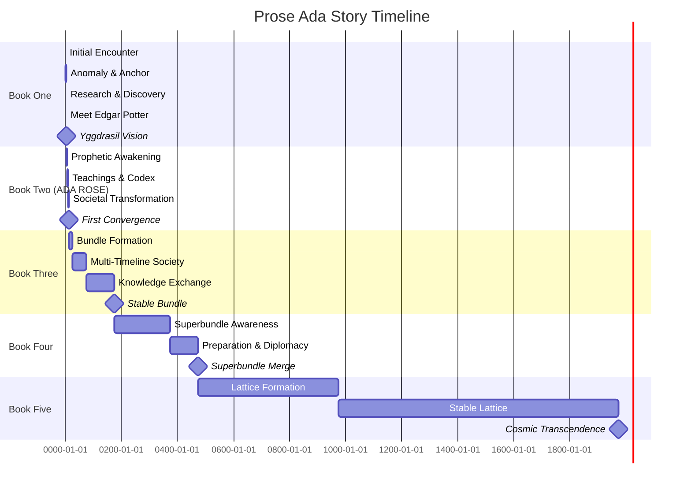
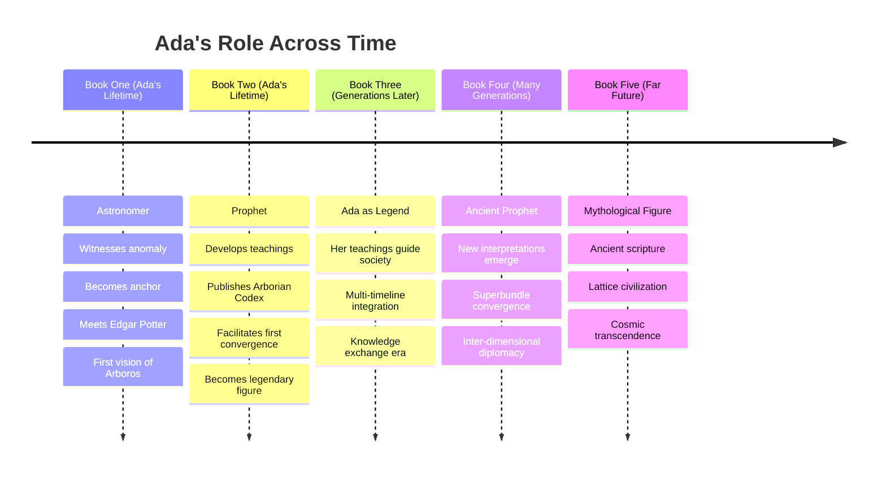
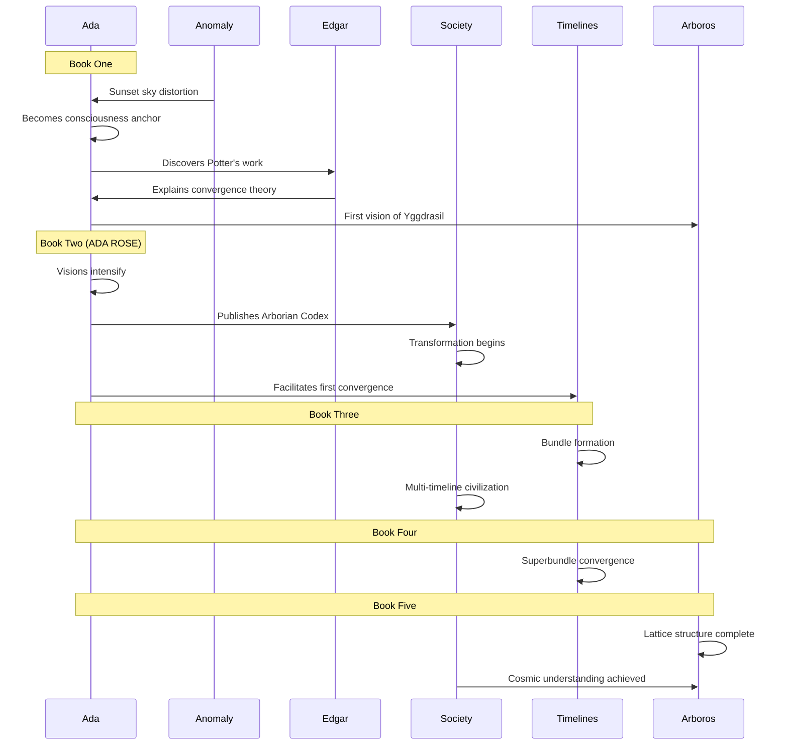

# Prose Ada - Story Timeline Visualization

A simplified timeline view of the story progression across all books.

## Main Story Timeline

## Timeline Convergence Progression

```mermaid
graph LR
    subgraph "Book One"
        T1[Single Timeline<br/>Our Reality]
    end
    
    subgraph "Book Two"
        T2[Timeline Resonance<br/>Consciousness Anchor]
        T3[First Convergence<br/>Two Timelines Merge]
    end
    
    subgraph "Book Three"
        T4[Bundle Formation<br/>~8-20 Timelines]
    end
    
    subgraph "Book Four"
        T5[Superbundle<br/>Multiple Bundles]
    end
    
    subgraph "Book Five"
        T6[Lattice Structure<br/>Cosmic Meta-Entity]
    end
    
    T1 -->|Consciousness Anchor| T2
    T2 -->|Intentional Merge| T3
    T3 -->|Stable Integration| T4
    T4 -->|Higher Convergence| T5
    T5 -->|Ultimate Structure| T6
    
    style T1 fill:#e1f5ff
    style T2 fill:#fff4e1
    style T3 fill:#ffe1f5
    style T4 fill:#e1ffe1
    style T5 fill:#f0e1ff
    style T6 fill:#ffe1e1
```

## Ada's Life Arc vs. Story Timeline

## Key Events Timeline

